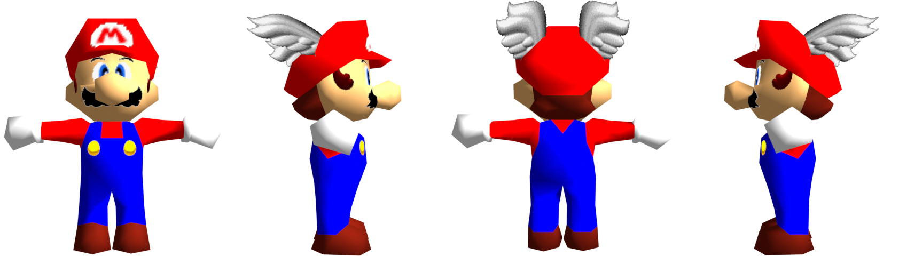

# [Lowpoly Skinned Mario](lowpoly_skinned_mario.blend)
A custom Mario model with skinning (connected limbs) and a reduced polygon count, also optimizes the textures to make them smaller without any drawbacks.

## Versions
- Blender 3.2+
- Fast64 2.2.2

## Credits
- [InTheBeef](https://github.com/kurethedead)
- [kurethedead](https://github.com/kurethedead): Small [Fixes](https://github.com/Fast-64/fast64/commit/500492b2f4f99570d8930f8be31bf928c572546b)