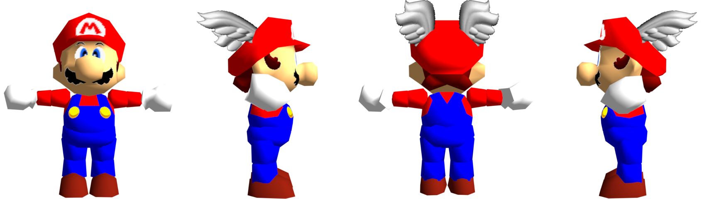
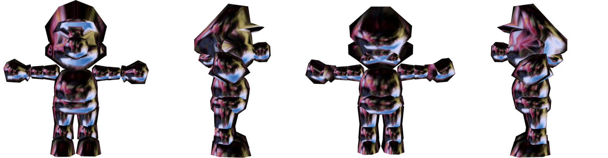

# [Mario](mario.blend)
The basic Mario model from SM64, does not include the LoDs.

## Versions
- Blender 3.2+
- Fast64 2.2.2

## Credits
- [kurethedead](https://github.com/kurethedead): For the original import and maintaining the model across new versions
- [YoshiMilkman](https://github.com/YoshiMilkman): For cleaning up the model to match vanilla Mario more closely (see [Fast64 #248](https://github.com/Fast-64/fast64/pull/248))